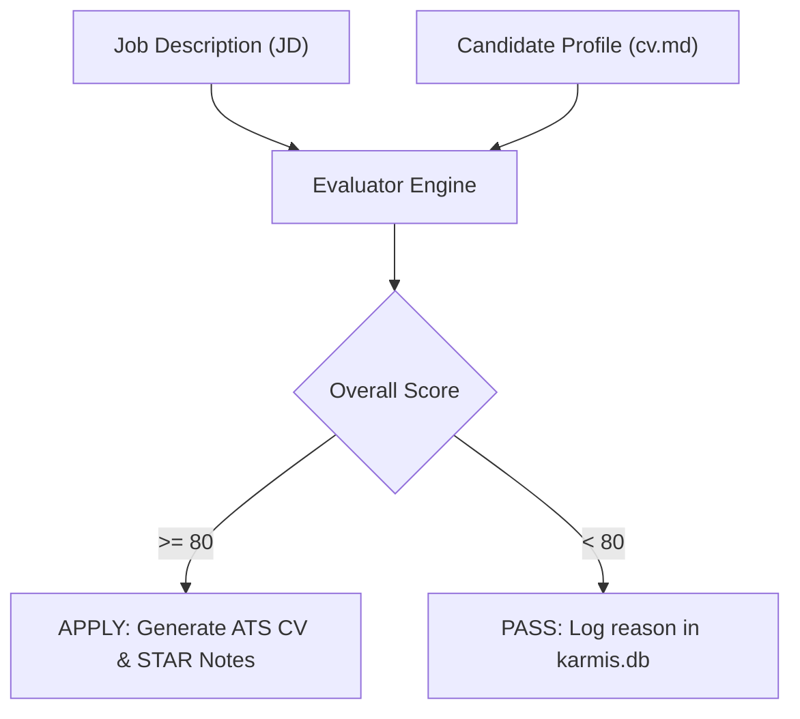

# Karmis Domain Context & Architecture

This document defines the business logic, candidate competencies, and scoring models for **Karmis**.

---

## 🎯 Purpose & Decision Matrix

KARMIS automates the initial screening of job opportunities against candidate profiles to eliminate manual triage overhead.

---

## 🔑 Core Domain Entities

* **`JobPosting`**: Parsed job opening (Title, Company, Seniority, Required Skills, Compliance Burden, Salary).
* **`CandidateProfile`**: Normalized experience and skill vector from `cv.md`.
* **`EvaluationScore`**: Weighted score (0-100) reflecting competency overlap and penalty factors.
* **`ApplicationRecord`**: SQLite record tracking application date, score, and pipeline stage.

---

## 🧩 Deep Module Interfaces

* **`Evaluator` (`lib/evaluator.js`):**
  * Interface: `evaluate(jobData, profileData): EvaluationResult`
  * Implementation: Keyword matching, penalty deduction, and decision thresholding.
* **`ChartGenerator` (`lib/svg-chart.js`):**
  * Interface: `generateBarChart(metrics): string (SVG)`
