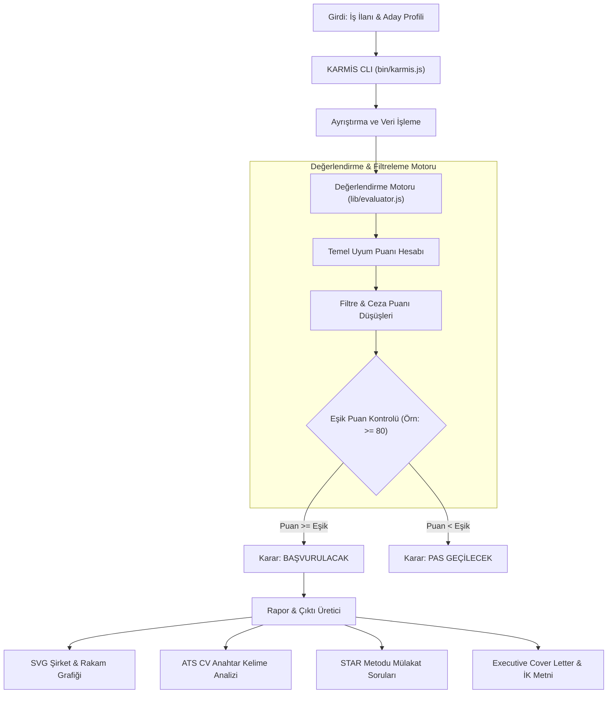

# KARMİS — Kariyer Mimarisi ve İlan Süzgeci

KARMİS (Kariyer Mimarisi ve İlan Süzgeci), iş ilanlarının aday profil yetkinlikleri ile otomatik olarak karşılaştırılmasını, risk analizlerinin yapılmasını, puanlanmasını ve başvuru süreçlerinin yönetilmesini sağlayan açık kaynaklı bir komut satırı (CLI) ve değerlendirme motorudur.

---

## Sistemin Çalışma Mantığı ve Mimari Şeması

KARMİS, girilen iş ilanı verilerini ve aday profilini alarak ceza/filtre kuralları üzerinden değerlendirir. Belirlenen başarı eşik puanına göre ilan hakkında nihai başvuru kararını üretir ve başvuru raporlarını hazırlar.



---

## Teknik Özellikler

- **Programlama Dili:** JavaScript (Node.js ES Modules)
- **Komut Satırı Arayüzü:** Node.js CLI Binary (`bin/karmis.js`)
- **Veri Depolama Engine:** SQLite (`better-sqlite3`)
- **Görselleştirme Katmanı:** Saf SVG Grafik Üreticisi (`lib/svg-chart.js`)
- **Lisans:** MIT Lisansı

---

## Temel Modüller ve Yetenekler

- **İlan Analiz ve Puanlama Motoru (`lib/evaluator.js`):** İş ilanı detayları ile aday profili arasındaki uyumu puanlar. Ağır mevzuat riski, junior seviyeye düşürme (downleveling) veya saha satış kotası gibi olumsuz şartlarda otomatik puan cezası uygular.
- **Karar Mekanizması:** Belirlenen eşik puana göre ilan için "BAŞVURULACAK" veya "PAS GEÇİLECEK" kararlarını üretir.
- **Rapor ve İletişim Metinleri Üretimi:**
  - ATS uyumlu CV anahtar kelime optimizasyon listesi
  - STAR tekniğine dayalı mülakat hazırlık soruları
  - İK ve yöneticilere özel LinkedIn iletişim metinleri
  - Şirket verilerine ait sade SVG grafik raporları

---

## Proje Klasör Yapısı

```text
├── bin/
│   └── karmis.js            # CLI arayüzü giriş dosyası
├── lib/
│   ├── evaluator.js         # İlan değerlendirme ve puanlama motoru
│   └── svg-chart.js         # Rapor grafik üreticisi
├── templates/               # Çıktı ve rapor şablonları
├── config.example.json      # Örnek konfigürasyon dosyası
├── package.json             # Bağımlılıklar ve CLI tanımları
└── LICENSE                  # MIT Lisansı
```

---

## Kurulum ve Kullanım

### Ön Gereksinimler
- Node.js 18.x veya üzeri sürüm

### Kurulum Adımları
```bash
# Projeyi klonlayın
git clone https://github.com/itisbehrouz/karmis.git

# Proje dizinine geçin
cd karmis

# Bağımlılıkları yükleyin
npm install

# CLI komutunu yerel ortamınıza bağlayın (optional)
npm link
```

### Örnek Çalıştırma
```bash
# Doğrudan Node ile çalıştırma
node bin/karmis.js "https://example.com/job-posting"

# npm start ile çalıştırma
npm start "https://example.com/job-posting"
```

---

## Geliştirici ve Proje Sahibi

- **Geliştirici:** Behrouz Bagherzadeh
- **GitHub Profil:** [itisbehrouz](https://github.com/itisbehrouz)
- **E-posta:** be.bagherzadeh@gmail.com
- **Repository:** [itisbehrouz/karmis](https://github.com/itisbehrouz/karmis)
