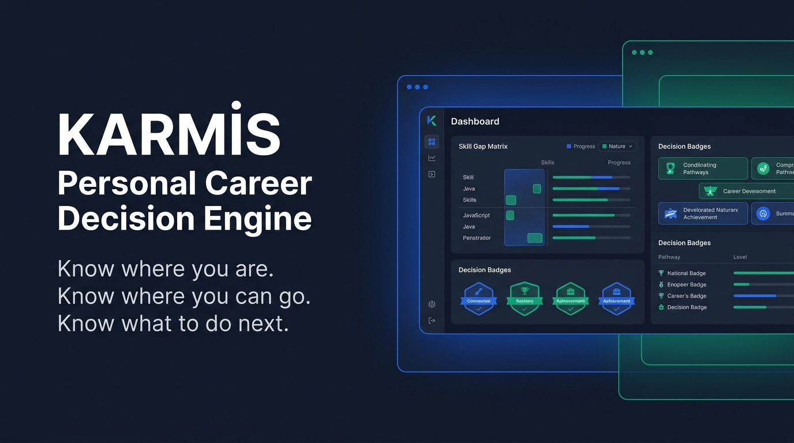

<div align="center">

# KARMİS

**Personal Career Decision Engine**

*Know where you are. Know where you can go. Know what to do next.*

<p align="center">
  
</p>

<br />



<br />

</div>

> **KARMİS** is an open-source, privacy-first career decision engine. Instead of generating generic motivational text, it runs deterministic decision algorithms locally on SQLite to model your career baseline, calculate skill gaps, evaluate opportunities across 11 dimensions, detect 17 career risks, and compute your single highest-leverage next move.

---

###  Domain-Neutral by Design

KARMİS is not designed exclusively for software engineering. It models career progression neutrally across all industries:
- **Domains:** Software & Data, Accounting & Finance, Sales & Marketing, Healthcare, Operations, HR, Legal, Consulting, Manufacturing.
- **Tiers:** Student, Intern, Entry-Level, Junior, Mid, Senior, Lead, Manager, Director, VP, C-Level, Founder, Freelancer, and Career Changer.

---

###  5 Core Principles

| # | Principle | Engineering Mandate |
| :-: | :--- | :--- |
| **1** | **Decision > Generation** | Deterministic multi-dimensional scoring over raw LLM text generation |
| **2** | **Evidence > Claims** | Verifiable metrics and concrete project deliverables over empty keywords |
| **3** | **Outcomes > Predictions** | Empirical recruitment funnel calibration over speculative certainty |
| **4** | **Actions > Advice** | Specific 30/60/90-day deliverables over abstract motivational coaching |
| **5** | **Ranges > Fake Precision** | Confidence intervals and salary bands over misleading single-number estimates |

---

###  Architecture & Core Engines

```text
┌─────────────────────────────────────────────────────────────────────────┐
│                           Presentation Layer                            │
│     CLI (bin/karmis.js)         │         Web Dashboard (Port 3005)     │
└─────────────────────────────────┬───────────────────────────────────────┘
                                  │
┌─────────────────────────────────▼───────────────────────────────────────┐
│                              Engine Layer                               │
│  - Career DNA (lib/dna.js)             - Skill Gaps (lib/skills.js)     │
│  - 11D Evaluator (lib/evaluator.js)    - 17-Point Risk (lib/risk.js)    │
│  - Evidence Wallet (lib/evidence.js)   - Next Best Move (lib/decision.js)│
│  - Scenario Simulator (lib/simulator)  - Funnel Analytics (analytics.js)│
└─────────────────────────────────┬───────────────────────────────────────┘
                                  │
┌─────────────────────────────────▼───────────────────────────────────────┐
│                       Persistence & AI Adapters                         │
│  - SQLite Engine & Migrations (lib/db.js, lib/migrations/)              │
│  - Optional AI Isolation Adapter (lib/ai/provider.js - 100% offline)   │
└─────────────────────────────────────────────────────────────────────────┘
```

| Module | Core File | Purpose |
| :--- | :--- | :--- |
| **Career DNA** | `lib/dna.js` | Models baseline identity, 14 seniority levels, constraints, and target career state |
| **Skill Gap Engine** | `lib/skills.js` | 11 taxonomy categories with 5-tier ratings (`STRONG`, `ADEQUATE`, `DEVELOPING`, `MISSING`, `UNKNOWN`) |
| **11D Job Evaluator** | `lib/evaluator.js` | Evaluates Skill, Seniority, Salary, Upside, Location, Risk, Opportunity Cost (`APPLY` / `PASS` / `MAYBE`) |
| **Expanded Risk Engine** | `lib/risk.js` | Detects 17 distinct career risks (downleveling, underpayment, quotas, bureaucracy) |
| **Evidence Wallet** | `lib/evidence.js` | Stores verified case studies and metrics; clearly separates missing skills from missing evidence |
| **Next Best Move** | `lib/decision.js` | Identifies primary bottleneck and generates concrete 30/60/90-day execution plans |
| **Career Simulator** | `lib/simulator.js` | Compares 8 paths (`STAY`, `PROMOTE`, `PIVOT`, `BUSINESS`) with 3-year income projections |
| **Funnel Analytics** | `lib/analytics.js` | Tracks interview/offer conversion rates and calibrates success probability over time |
| **Web Dashboard** | `dashboard/` | Port 3005 high-density executive panel with Flowbite SVG icons and zero telemetry |

---

###  Quickstart

```bash
# Clone the repository
git clone https://github.com/itisbehrouz/karmis.git && cd karmis

# Install dependencies
npm install

# Initialize local SQLite database and baseline Career DNA
node bin/karmis.js init

# Launch local dashboard
node bin/karmis.js dashboard
```

Open `http://localhost:3005` in your browser.

---

###  CLI Command Reference

```bash
# Baseline & Career State
node bin/karmis.js profile              # Inspect current Career DNA
node bin/karmis.js profile import cv.json # Import structured profile
node bin/karmis.js career               # Display current vs target state

# Decision Engines
node bin/karmis.js gap                  # Execute 5-tier skill gap analysis
node bin/karmis.js evidence             # View Evidence Wallet items
node bin/karmis.js next                 # Compute single highest-leverage next move
node bin/karmis.js simulate             # Compare 8 career simulation paths

# Job Evaluation & Tracking
node bin/karmis.js analyze <company>    # Run 11-dimension evaluation
node bin/karmis.js job <job.json|txt>   # Parse job file and generate decision
node bin/karmis.js applications         # View recruitment pipeline
node bin/karmis.js applications sync    # Synchronize Google Drive CSV (ABSG)
node bin/karmis.js analytics            # View interview/offer conversion rates
```

---

###  Executive Dashboard

The local dashboard immediately answers five strategic career questions:
1. **Where am I?** (Current level, role, and market position)
2. **Where am I going?** (Target role, target level, and timeline)
3. **What is blocking me?** (Top skill gaps and evidence bottlenecks)
4. **Which opportunities are worth pursuing?** (11-dimension job decision matrix)
5. **What should I do next?** (Single highest-leverage action and 30/60/90-day plan)

---

###  Privacy & Security

- **100% Local-First:** All applicant profiles and job data stay inside `data/karmis.db`.
- **Zero Telemetry:** No remote analytics, tracking scripts, or pixel pings.
- **Offline Reliability:** All core scoring, gap, and risk calculations run completely offline without external network dependencies.
- **AI Optionality:** Operates fully without third-party LLM API keys.

Detailed policy: [docs/KARMIS-PRIVACY.md](docs/KARMIS-PRIVACY.md).

---

###  Development

KARMİS is written in modern, dependency-light Node.js. Business logic is organized into clean, deterministic modules inside `lib/`.

```bash
# Initialize local database schema
node bin/karmis.js init

# Start local development server
node bin/karmis.js dashboard
```

Guidelines:
- Maintain deterministic calculations for all scoring and penalty engines.
- Keep the SQLite schema versioned through `lib/migrations/`.
- Isolate any optional AI text completion behind `lib/ai/provider.js`.
- Use official Flowbite SVG icons for all user interface components.

---

###  Automated Testing

KARMİS enforces automated test coverage across all decision engines using the native Node.js test runner (`node:test`).

```bash
npm test
```

Verification suite includes:
- **12 Test Suites / 56 Subtests** passing with 0 failures
- Multi-dimensional scoring across all 11 evaluation dimensions
- 17 career risk rules and penalty filters
- 3-state decisions (`APPLY`, `PASS`, `MAYBE`)
- Skill gap analysis and evidence matching
- 8 simulation scenarios and multi-step salary trajectories
- Next Best Move bottleneck identification and action plans
- SQLite migrations and CSV synchronization
- CLI commands and HTTP dashboard API endpoints

---

###  Product Roadmap

- **Phase 1 (Complete):** Architecture audit and baseline system analysis.
- **Phase 2 (Complete):** Career DNA schema, target career state, and profile store.
- **Phase 3 (Complete):** Skill taxonomy and 5-tier gap analysis engine.
- **Phase 4 (Complete):** 11-dimension job decision engine with 17 risk filters.
- **Phase 5 (Complete):** Evidence Wallet with skill-to-evidence matching.
- **Phase 6 (Complete):** Next Best Move engine and 30/60/90-day action plans.
- **Phase 7 (Complete):** 8-path career scenario simulator and salary trajectory models.
- **Phase 8 (Complete):** Application tracker with empirical recruitment funnel analytics.
- **Phase 9 (Complete):** High-density local web dashboard with Flowbite SVG icons.
- **Phase 10 (In Progress):** Multi-profile management, advanced export formats, and local LLM fine-tuning.

Detailed roadmap: [docs/KARMIS-ROADMAP.md](docs/KARMIS-ROADMAP.md).

---

###  Technical Documentation

- [Architecture Audit](docs/KARMIS-V2-ARCHITECTURE-AUDIT.md)
- [Domain Model](docs/KARMIS-DOMAIN-MODEL.md)
- [Scoring Engine](docs/KARMIS-SCORING-ENGINE.md)
- [Database Architecture](docs/KARMIS-DATABASE.md)
- [Privacy Policy](docs/KARMIS-PRIVACY.md)
- [Product Roadmap](docs/KARMIS-ROADMAP.md)

---

###  License

MIT License. See [LICENSE](LICENSE) for details.
