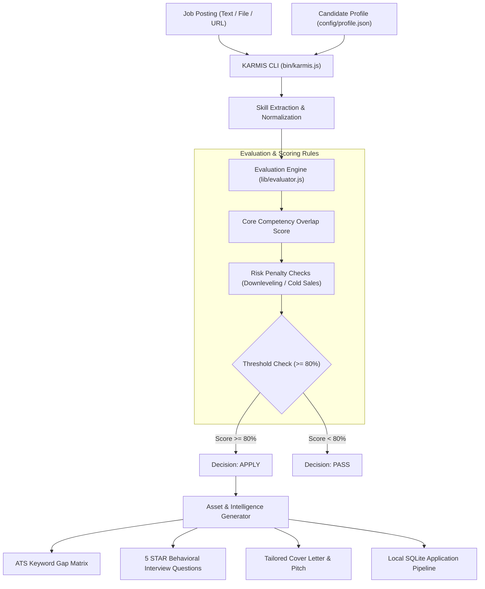

# KARMİS — Career Architecture & Job Application Evaluator

[](LICENSE)
[](https://nodejs.org/)
[](CONTRIBUTING.md)

KARMIS is a privacy-first, open-source CLI engine and local web dashboard for job posting evaluation, candidate skill alignment, ATS keyword gap analysis, and application tracking.

All data stays on your computer. KARMIS stores applications and notes in a local SQLite database.

---

## 🏛️ Architecture & Evaluation Flow



---

## ⚡ Key Capabilities

- **Dynamic Skill Matcher:** Extracts technical requirements from any job description and compares them with your profile.
- **ATS Gap Analysis:** Highlights both matching competencies and missing critical keywords.
- **Risk Penalty Filter:** Detects downleveling, heavy compliance bureaucracy, and cold sales quotas.
- **Local Application Tracker:** Visual web dashboard (Port 3005) with Kanban stages, status updates, and follow-up cadences.
- **Interview Intelligence:** Generates 5 tailored STAR behavioral questions and 30-60-90 day onboarding plans.
- **100% Offline & Private:** Operates entirely locally via SQLite. No cloud accounts or mandatory API keys required.

---

## 📁 Repository Structure

```text
├── bin/
│   └── karmis.js              # CLI binary executable
├── config/
│   └── profile.example.json   # Template candidate profile
├── dashboard/
│   └── index.html             # Local web application dashboard
├── lib/
│   ├── cadence.js             # Follow-up reminder engine
│   ├── cv-parser.js           # Decoupled resume parser
│   ├── db.js                  # Native SQLite persistence layer
│   ├── evaluator.js           # Dynamic evaluation & skill taxonomy
│   ├── interview-prep.js      # STAR question simulation generator
│   ├── report-generator.js    # Markdown intelligence report builder
│   ├── server.js              # Local dashboard HTTP server (Port 3005)
│   └── tailored-cv.js         # Tailored CV and cover letter generator
├── samples/                   # Sample job postings and test files
├── templates/                 # Reusable resume and report templates
├── test/                      # Automated test suite
├── package.json
└── LICENSE                    # MIT License
```

---

## 🚀 Quick Start

### Prerequisites
- Node.js 18.x or higher
- Git

### Installation
```bash
# Clone the repository
git clone https://github.com/itisbehrouz/karmis.git

# Navigate to project directory
cd karmis

# Install dependencies
npm install

# Link CLI command globally (optional)
npm link
```

### 1. Initialize Your Profile
```bash
node bin/karmis.js init
```
This command creates `config/profile.json` and `resume.md`. Open `config/profile.json` and add your technical skills and experience.

### 2. Evaluate a Job Posting
```bash
# Evaluate from raw text
node bin/karmis.js eval "Senior Backend Engineer with Node.js, TypeScript, PostgreSQL, and Docker"

# Evaluate from sample JSON file
node bin/karmis.js eval samples/job-posting-sample.json
```

### 3. Launch Local Dashboard (Port 3005)
```bash
npm run dashboard
# Open http://localhost:3005 in your browser
```

### 4. Run Automated Tests
```bash
npm test
```

---

## 🇹🇷 Türkçe Özet

KARMİS, adayların iş ilanlarını analiz etmesini, CV uyum puanını hesaplamasını ve başvuru süreçlerini yerel olarak yönetmesini sağlayan açık kaynaklı bir kariyer operasyon motorudur.

- **Yerel Veritabanı:** Tüm başvurularınız bilgisayarınızdaki SQLite (`karmis.db`) veritabanında saklanır.
- **ATS Analizi:** İlandaki zorunlu yetkinlikleri ayıklar ve profilinizdeki eksik anahtar kelimeleri listeler.
- **Mülakat Hazırlığı:** İlana özel 5 adet STAR metodu mülakat simülasyonu ve takip takvimi üretir.
- **Web Paneli:** Port 3005 üzerinden çalışan modern takip arayüzü sunar.

---

## 🤝 Contributing

Contributions are welcome! Please read [CONTRIBUTING.md](CONTRIBUTING.md) before submitting pull requests.

---

## 📄 License

This project is licensed under the [MIT License](LICENSE).

For inquiries and community discussions, visit [GitHub Issues](https://github.com/itisbehrouz/karmis/issues).
